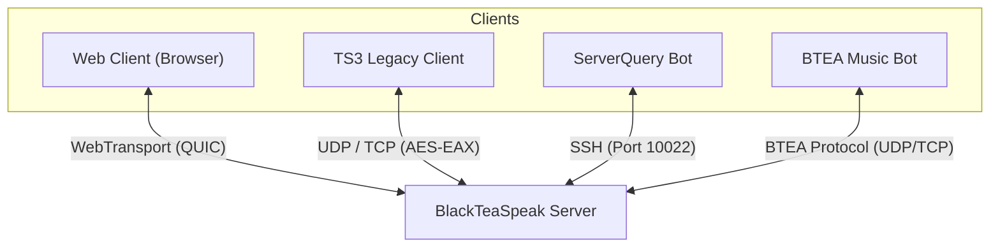

# 3. System Scope and Context

The BlackTeaSpeak server acts as a centralized routing and state management system.

## 3.1 Business Context

## 3.2 Technical Context
- **Port 9987 (UDP/TCP)**: Desktop Compat Transport & WebTransport Datagrams.
- **Port 10022 (TCP)**: SSH Query Transport (powered by `russh`).
- **Port 30303 (TCP)**: File Transfer server (custom HTTP-like transfer).
- **Database**: SQLite3 local persistent storage (`blackteaspeak.db`).
