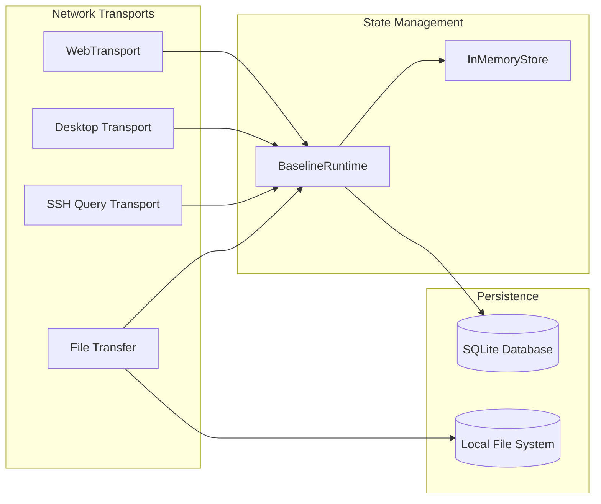

# 5. Building Block View

## Level 1: Whitebox Overall System

### Components
1. **`BaselineRuntime` (`src/runtime.rs`)**: Master arbiter. Responsible for executing commands, verifying permissions, and routing media using `route_btea_media_to_desktop`.
2. **`InMemoryStore`**: Manages ephemeral objects like `OnlineClient`, active connections, and `music_bots` tracking.
3. **`Desktop Transport`**: Demultiplexes standard UDP payloads using Chacha20-Poly1305.
4. **`WebTransport`**: Converts standard HTTP/3 QUIC Datagrams into standard `btea` media payloads.
