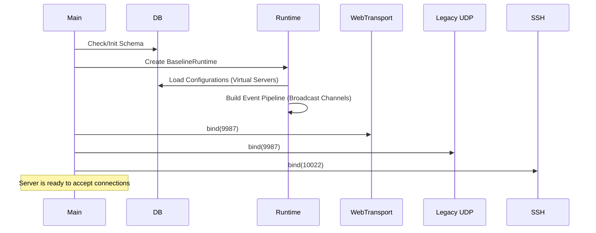

# 6. Runtime View

## 6.1 Server Startup Sequence

## 6.2 Permission Evaluation Flow
Whenever a client executes a command:
1. `ssh_query` / `desktop_transport` / `web_transport` converts the payload into `CommandRequest`.
2. `BaselineRuntime::dispatch()` matches the command.
3. Call `BaselineRuntime::has_permission(client_id, PERM_ID)`.
   - Checks Client-Specific Permissions.
   - If inherited: Checks Channel Group Permissions.
   - If inherited: Checks Server Group Permissions.
4. Returns boolean. If true, process command. If false, return `QueryResponse::error(insufficient_client_permissions)`.
