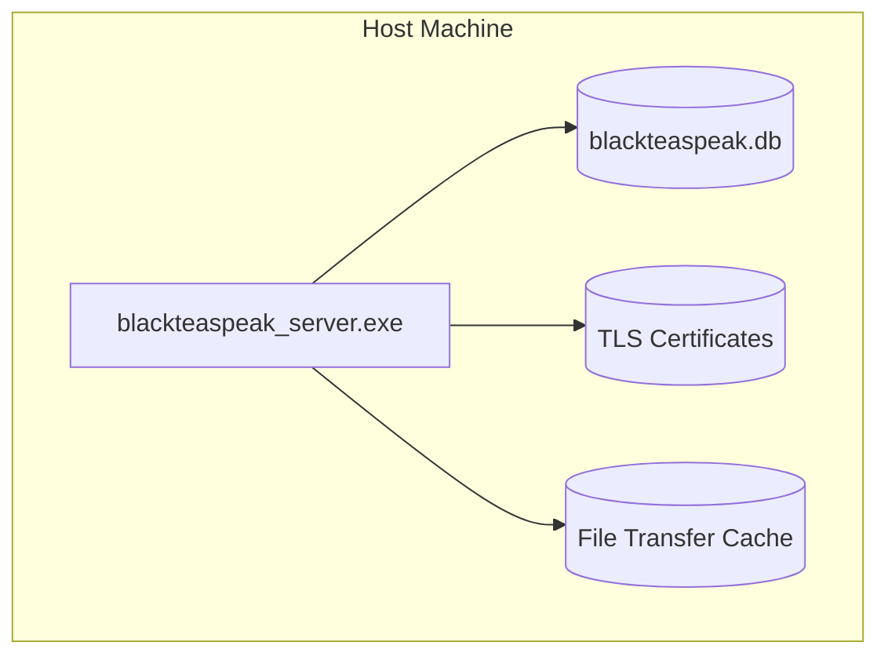

# 7. Deployment View

BlackTeaSpeak runs as a single static binary. It does not require a complex multi-container setup unless scaling out media routing is strictly required.

**Required Ports**:
- `9987/UDP`: Legacy Voice and BTEA Media Protocol.
- `9987/TCP`: Fallback TCP connections.
- `8080/TCP`: HTTP BlackTeaWeb Server Client.
- `10022/TCP`: SSH ServerQuery Interface.
- `30303/TCP`: Avatar & Icon Transfers.
