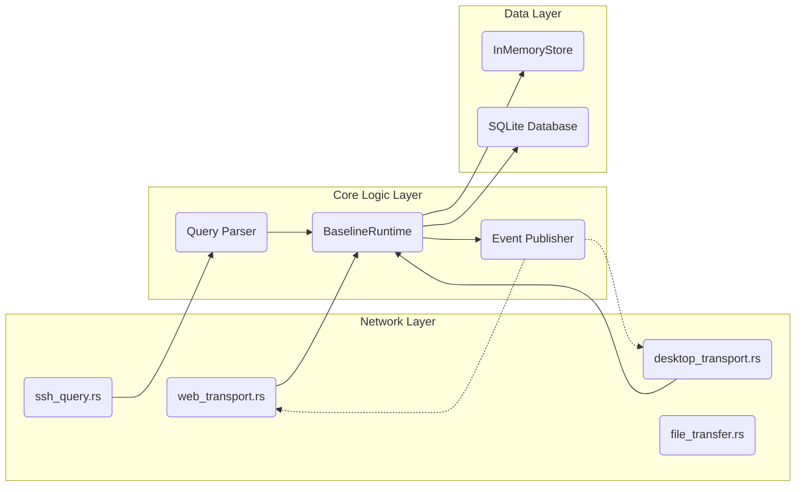
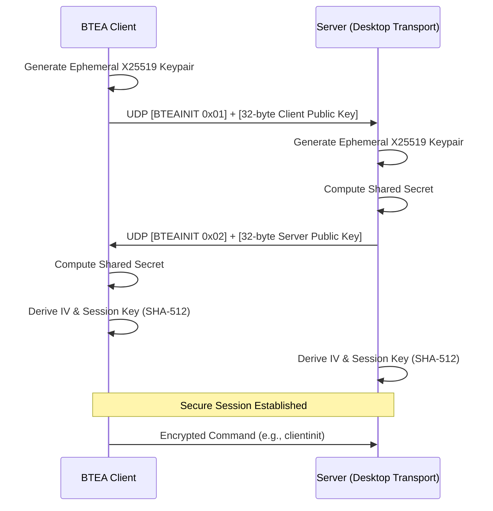
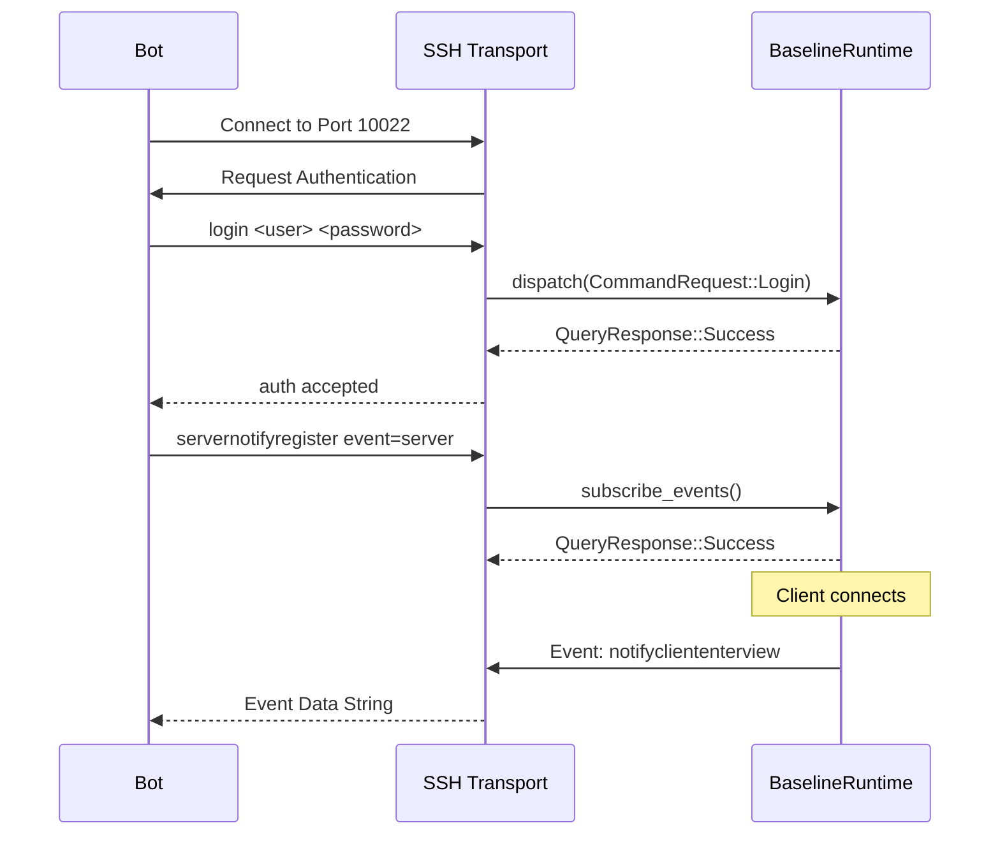
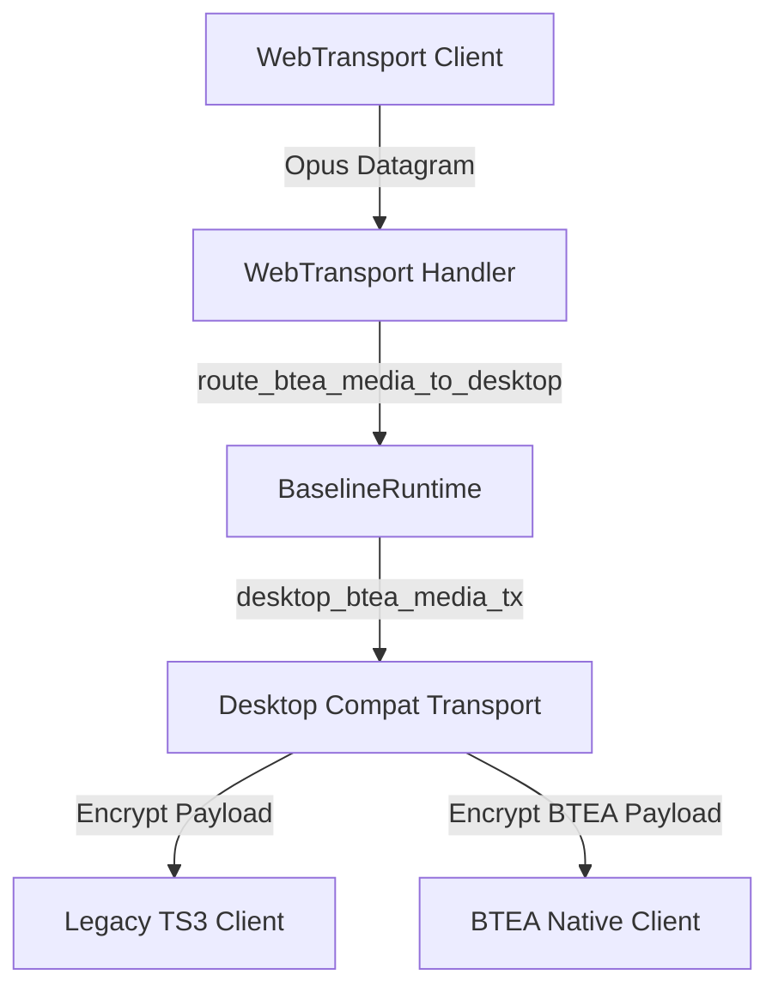

# BlackTeaSpeak Server Architecture & Integration Documentation (arc42)

## 1. Introduction and Goals
BlackTeaSpeak is a modern, high-performance voice and data server designed to replace legacy TeamSpeak 3 backends while maintaining robust backward compatibility. It introduces modern transports (WebTransport, WebCodecs) for browser-native communication, the lightweight BTEA protocol for high-performance bots and integrations, and a secure SSH-based ServerQuery interface.

**Key Goals:**
- **Backward Compatibility:** Seamless support for existing legacy TS3 desktop clients.
- **Modernization:** Browser-first WebTransport and WebCodecs integration for zero-install client usage.
- **Extensibility:** Simplified bot and third-party addon integrations via the BTEA protocol and secure SSH ServerQuery.
- **Security:** Complete removal of unencrypted Telnet fallbacks; modern X25519 cryptography for BTEA.

---

## 2. Architecture Constraints
- **Performance:** Must route latency-sensitive Opus audio packets in under 10ms.
- **State Management:** All virtual servers, channels, and connected clients must be managed by a single cohesive `BaselineRuntime` arbiter.
- **Legacy Compatibility:** UDP parsing must adhere to AES-EAX / Chacha20-Poly1305 TS3 packet structures when servicing legacy clients.

---

## 3. System Scope and Context

The system interacts with various external clients and tools, bridging communication across different protocol paradigms seamlessly.

```mermaid
flowchart TD
    subgraph Clients
        WebClient["Web Browser Client<br/>WebTransport / WebCodecs"]
        LegacyClient["Legacy TS3 Client<br/>UDP / TCP"]
        BTEABot["Custom BTEA Bot / App<br/>UDP / TCP"]
        AdminTool["Admin Script / Bot<br/>SSH"]
    end

    subgraph BlackTeaSpeak Server
        Core[BaselineRuntime & State Arbiter]
        WT["WebTransport Gateway<br/>Port 9987"]
        Legacy["Desktop Compat Transport<br/>Port 9987"]
        SSH["SSH Query Transport<br/>Port 10022"]
        FT["File Transfer Transport<br/>Port 30303"]
        DB[(SQLite Database)]
    end

    WebClient <-->|WebTransport (QUIC)| WT
    LegacyClient <-->|Encrypted UDP/TCP| Legacy
    BTEABot <-->|BTEA Protocol| Legacy
    AdminTool <-->|Encrypted SSH| SSH
    WebClient <-->|HTTP/HTTPS| FT
    LegacyClient <-->|HTTP/HTTPS| FT

    WT <--> Core
    Legacy <--> Core
    SSH <--> Core
    FT <--> Core
    Core <--> DB
```

---

## 4. Building Block View

The core server is modular, separating network transport handlers from the core logic and state management.



### Components Description
- **`BaselineRuntime`**: The master state arbiter. Holds the `InMemoryStore`, executes query commands, and enforces antiflood/permission checks.
- **`InMemoryStore`**: Tracks ephemeral state (Online Clients, BTEA Audio Routing maps) and caches persistent state (Channels, Permissions, Virtual Servers).
- **`SSH Query Server`**: Uses the `russh` crate to bind an authentic SSH interface. Translates SSH streams into TS3 Query commands.
- **`WebTransport Gateway`**: Uses Quinn/QUIC to provide high-speed, secure datagrams for Opus audio and reliable streams for commands.
- **`Desktop Compat`**: Parses standard TS3 UDP packets and proprietary `BTEAINIT` handshakes.

---

## 5. Runtime View

### 5.1 BTEA Protocol Handshake Sequence
The BTEA protocol completely replaces the complex TS3 puzzle mechanism with a fast, zero-puzzle X25519 ECDH key exchange.



### 5.2 ServerQuery SSH Bot Command Flow
Third-party bots execute commands via the secure SSH interface.



### 5.3 Cross-Protocol Media Routing
When a WebTransport client sends audio, it is routed to legacy desktop clients and BTEA clients seamlessly.



---

## 6. 3rd Party Developer Integration Guide

### Integrating via SSH ServerQuery
Bots and Administration tools no longer use unencrypted Telnet. They must connect via SSH.

**Connection Details:**
- **Host**: Your Server IP
- **Port**: `10022`
- **Authentication**: Prompted via standard SSH Password Auth (use `serveradmin` credentials).

**Execution Flow:**
1. Connect via an SSH client library (e.g., `paramiko` in Python, `ssh2` in Node.js).
2. Execute the `use <server_id>` command to select the virtual server.
3. Register for events using `servernotifyregister event=server`.
4. Issue commands like `clientlist`, `clientmove`, `channelcreate`. The syntax is 100% TS3 query compatible.

### Integrating via BTEA Protocol
For high-performance media bots (like music bots), the lightweight BTEA protocol over UDP/TCP is recommended to bypass complex puzzle logic.

**Implementation Steps:**
1. Send `BtInitRequest`: A UDP packet containing the string `BTEAINIT`, byte `0x01`, and your 32-byte X25519 Public Key.
2. Parse `BtInitResponse`: Read the server's 32-byte X25519 Public Key.
3. Derive Keys:
   - `iv`: `SHA512(ServerPublicKey || SharedSecret)`
   - `session_key`: `SHA512(ClientPublicKey || SharedSecret)`
4. Send Commands: Encrypt standard TS3 commands using `AES-EAX` or `AES-GCM` with the derived session key. Use packet flag `0x02` for commands.
5. Send Native Audio: Send raw Opus frames using packet flag `0x0A`. The server will automatically route these frames to all clients in the channel.

*See `docs/btea_protocol.md` and `src/bin/test_btea_client.rs` in the source repository for detailed byte-level struct layouts and Rust implementation examples.*

---

## 7. Persistence & Data Schema
All persistent server data is stored in a local SQLite database (`blackteaspeak.db`).

The schema supports:
- `virtual_servers`: Configuration per instance (port, max clients, flood config).
- `channels`: Hierarchical channel structures.
- `clients`: Historical client connections and traffic statistics.
- `permissions`: Client, Channel, and Group permission mappings using standard integer-based permission IDs.

Integrators are discouraged from modifying the SQLite database directly while the server is running, as `BaselineRuntime` aggressively caches state in the `InMemoryStore`. Always use the SSH Query interface for modifications.

---

## 8. Quality Requirements
- **Low Latency**: The event pub/sub system uses `tokio::sync::broadcast` to ensure media packet routing overhead between WebTransport and Desktop clients remains under 1ms locally.
- **Robustness**: Panics in individual network clients are caught at the connection boundary. The `BaselineRuntime` uses `Arc<Mutex<T>>` locking to prevent data races and ensure isolated atomic operations.
